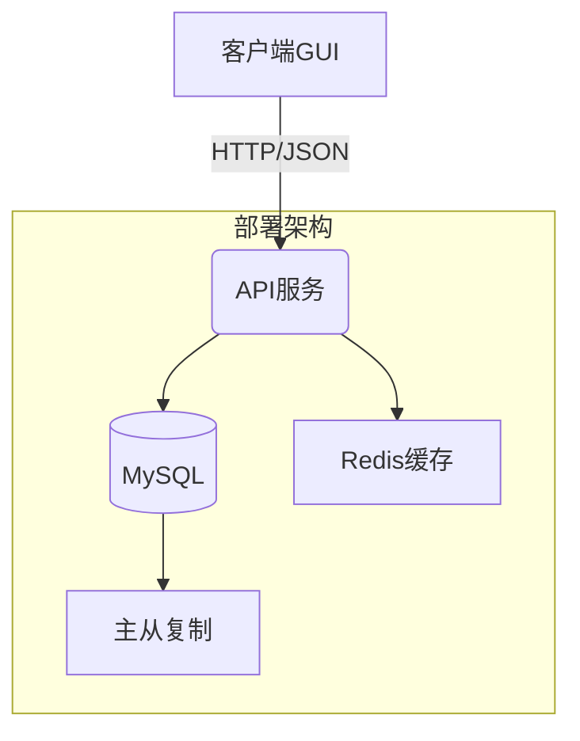

# Mini ERP 系统

这是一个基于Docker和MySQL的小型ERP系统，前端使用Fyne框架开发GUI界面，后端采用Go语言开发RESTful API。

## 系统架构


- 前端：使用Fyne框架开发的GUI应用
- 后端：Go语言开发的RESTful API服务
- 数据库：MySQL 8.0
- 容器化：使用Docker和docker-compose管理服务

## 主要功能

- 用户认证和授权
- 库存管理
- 订单处理
- 财务管理

## 目录结构

```
.
├── client/        # 前端GUI应用
│   └── ttf/      # 字体文件目录
├── server/       # 后端服务入口
├── docker-compose.yml
├── Dockerfile
├── init.sql       # 数据库初始化脚本
├── go.mod
├── go.sum
└── README.md
```

## 快速开始

### 数据库初始化
1. 确保MySQL服务运行后执行：
   ```bash
   docker exec -i mini-erp-mysql mysql -uroot -p$MYSQL_ROOT_PASSWORD < init.sql
   ```
2. 初始化脚本会创建：
   - 业务数据库 `erp_system`
   - 系统管理员账户 `admin@erp.com`

### 客户端打包
```bash
# Windows
fyne package -os windows -icon client/ttf/icon.png

# Windows中文显示支持
请确保将msyh.ttf字体文件放置在client/ttf目录，并在代码中加载：
```go
font := &fyne.StaticResource{
    StaticName: "msyh",
    StaticContent: []byte(loadFont("client/ttf/msyh.ttf")),
}
```

# macOS
fyne package -os darwin -icon assets/icon.png

# Linux
fyne package -os linux -icon assets/icon.png
```
打包后的程序会生成在`build/bin`目录

### 启动后端服务

1. 确保已安装Docker和docker-compose
2. 在项目根目录下运行：
   ```bash
   docker-compose up -d
   ```
3. 初始化数据库结构：
   ```bash
   docker exec -i mini-erp-mysql mysql -uroot -p"$MYSQL_ROOT_PASSWORD" < init.sql
   ```

这将完成以下操作：
1. 启动MySQL数据库和后端服务
2. 创建erp数据库及用户
3. 初始化数据表结构

### 运行前端应用

1. 确保已安装Go 1.20或更高版本
2. 安装依赖：
   ```bash
   go mod download
   ```
3. 运行前端应用：
   ```bash
   go run cmd/client/main.go
   ```

## 部署配置

### 服务端环境变量
```ini
DB_HOST=mysql
DB_PORT=3306
DB_USER=erp_user
DB_PASSWORD=erp_password
JWT_SECRET=your_jwt_secret_key
```

### 端口说明
| 服务    | 端口  | 协议  |
|---------|-------|-------|
| API     | 8080  | HTTP  |
| MySQL   | 3306  | TCP   |

## 开发说明

- 后端API服务运行在8080端口
- MySQL数据库运行在3306端口
- 前端GUI应用使用Fyne框架，支持跨平台运行

## 通信协议
- RESTful API 使用 JSON 格式
- 身份验证：JWT Bearer Token
- API版本：v1 通过请求头 `Accept: application/vnd.erp.v1+json`

## 注意事项
- 生产环境请修改默认数据库密码和JWT密钥
- Windows打包需要提前安装Microsoft Visual C++构建工具

- 首次运行时，系统会自动初始化数据库结构
- 默认的数据库用户名和密码在docker-compose.yml中配置
- 建议在开发环境中使用.env文件管理环境变量
